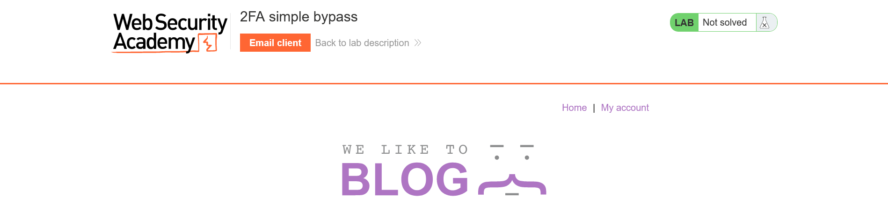
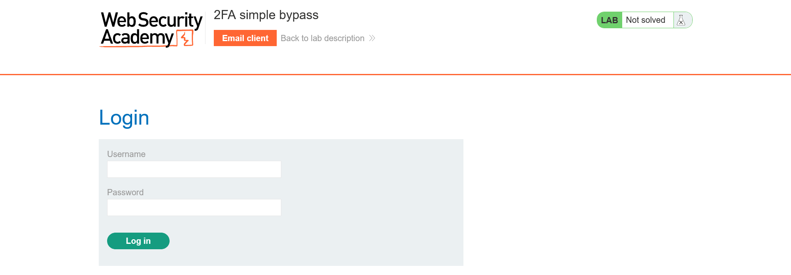
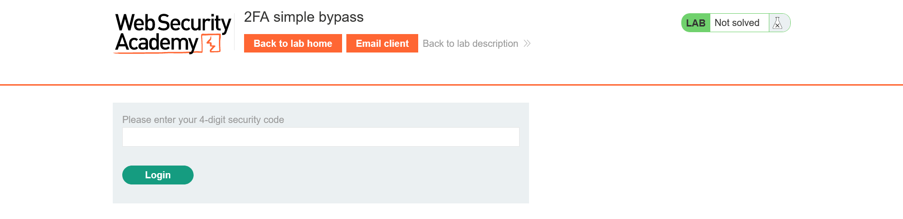

# Lab: 
Level: #Apprentice

## Description
Taken from the [portswigger lab](https://portswigger.net/web-security/authentication/multi-factor/lab-2fa-simple-bypass):

*This lab's two-factor authentication can be bypassed. You have already obtained a valid username and password, but do not have access to the user's 2FA verification code. To solve the lab, access Carlos's account page.*

-   Your credentials: `wiener:peter`
-   Victim's credentials `carlos:montoya`


## Enumeration
When Access de lab it would run a website in a random subdomain with the following structure:

`https://[random-32-hex-value].web-security-academy.net/`
The first  page's section looks like:
```
https://0ac20000030763d1c0fb4df400b100c5.web-security-academy.net
```


Go to the `My account` send me to `/login` view:
```
https://0ac20000030763d1c0fb4df400b100c5.web-security-academy.net/login
```



```
https://0ac20000030763d1c0fb4df400b100c5.web-security-academy.net/login2
```


If I use the credentials `carlos:montoya` and i write direcly `/my-account`  in the browser:

```
https://0ac20000030763d1c0fb4df400b100c5.web-security-academy.net/my-account
```


That means that the `/login2` could be bypasses.
